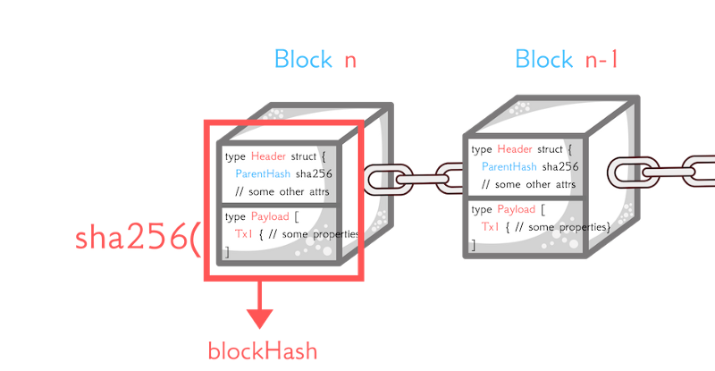
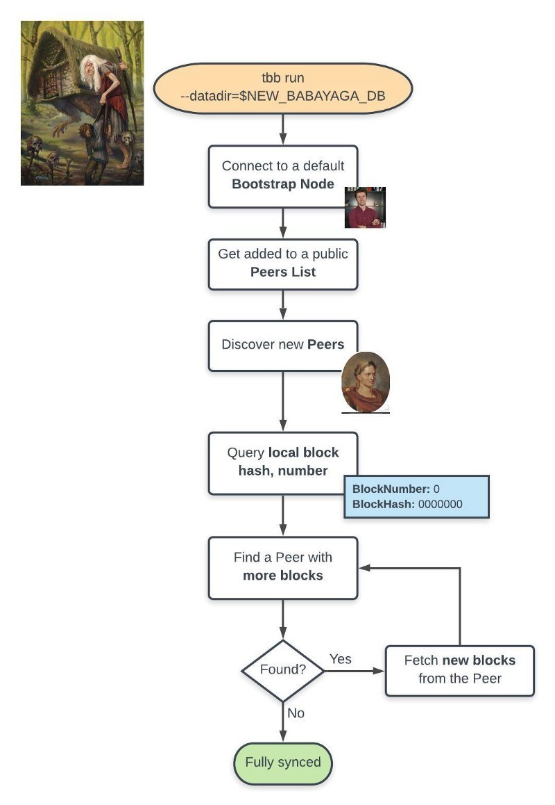

# the-blockchain-bar

Project from Lukas book Build Blockchain From Scratch In Go

## Book Summary

### 1 - The MVP Database

- Blockchain is a database
- The token supply, initial user balances, and global blockchain settings you define in a Genesis fle.
- Every blockchain has a **Genesis** file. This file is used to distribute the first tokens to early blockchain participants.

### 2 - Mutating Global DB State

- **Genesis** file indicate what was the original blockchain state and never updated afterwards.
- The database state changes are called **Transactions** (TX).

### 3 - Monolith Event vs Transaction

- Transactions are old fashion Events representing actions within the system

### 4 - Humans Are Greedy

- Closed software with centralized access to private data and rules puts only a few people to the position of power. Users don’t have a choice, and shareholders are in business to make money.

### 5 - Why We Need Blockchain

- Blockchain developers aim to develop protocols where applications’ entrepreneurs and users synergize in a transparent, auditable relationship. Specifications of the blockchain system should be well-defined from the beginning and only change if its users support it.

### 6 - L'Hash de Immutable

- The database content is hashed by a secure cryptographic hash function. The blockchain participants use the resulted hash to reference a specific database state.

### 7 - The BlockChain Programming Model

- The ParentHash is being used as a reliable “checkpoint,” representing and referencing the previously hashed database content.

- Transactions are grouped into batches for performance reasons. A batch of transactions make a Block. Each block is encoded and hashed using a secure, cryptographic hash function.

- Block contains Header and Payload. The Header stores various metadata such a time and a reference to the Parent Block (the previous immutable database state). The Payload carries the new database transactions.

- ParentHash improves performance. Only new data + reference to previous state needs to be hashed to achieve immutability.

### 8 - Transparent Database

#### Flexible DB Directory

Setup:

- Create `tbb/database` folder in `$HOME` folder
- Copy `block.db` file from `./database/block.db` to `$HOME/tbb/database`
- Run: `./tbb balances list --datadir=$HOME/tbb .tbb`

### 9 - It Takes Two Nodes To Tango

#### Designing a Peer to Peer Sync Algorithm

1. As Andrej

- Can share his database with everyone
- His database won't become the only source of truth
- There are copies of bar database in the world
- The bar will work if the node is turned off

2. As Babayaga

- Can automatically get copy of updated Andrej's database
- Verify how much TBB token she has
- Can test program business logic and ensure there are no hidden fees when transfer token to someone
- To be "the master" database
- Update database even if Andrej's node is offline

3. Julius Caesar

- Able bidirectionlly synchronize his database with anyone currently online
- Always have up to date overview of bar situation and activity

#### Why is the boostrap node necessary?

- The bootstrap node is used to initiate the peer discovery, and blockchain synchronization. By connecting to bootstrap node, user node able to discover others node and sync the db.
